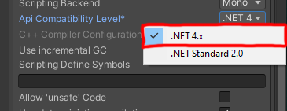

# 32feet.Unity.Example
> Example project to use 32feet inside Unity Engine (Bluetooth Classic)

This project teaches you how to use [32feet](https://github.com/inthehand/32feet)
inside your Unity project. You would only need a little experience
of Unity in order to understand and interact with `32feet` library.

## Dependencies

What are inside this example project?

* [NuGetForUnity](https://github.com/GlitchEnzo/NuGetForUnity)
* [32feet - InTheHand.Net.Bluetooth](https://github.com/inthehand/32feet)

## :books: Explanation

Here explains how this project is built.

### :mag: Step 1. Add package `NuGetForUnity` to Unity Project

Please download the `.unitypackage` file from NuGetForUnity release
page. Link [here](https://github.com/GlitchEnzo/NuGetForUnity/releases).

After that, please import the downloaded package to your unity project
just like other unity regular packages.

### :mag: Step 2. Install `InTheHand.Net.Bluetooth` through `NuGet`

Click `NuGet` -> `Manage NuGet Packages` to open the NuGet windows.
Then type `32feet` into search bar and find the package `InTheHand.Net.Bluetooth`
to install.

### :mag: Step 3. Set `Api Compatibility Level`

`32feet` library requires .NET 4.x or above. Please navigate to
`Edit` -> `Project Settings` -> `Player` and find `Api Compatibility
Level*`. Select and replace `.NET Standard 2.0` to `.NET 4.x`.

### :tada: Done, and Enjoy! :partying_face:

You can now create new script and start using the 32feet bluetooth library
interface. You might want to checkout the document [here](http://inthehand.github.io/html/R_Project_InTheHand.htm).

## Contribution

N/A

## License

[MIT](LICENSE) © [Jen-Chieh Shen](https://github.com/jcs090218)
